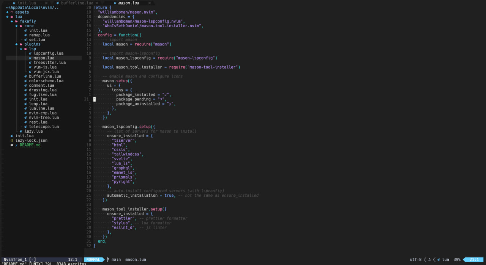

# Nvim configuration files. _(by Axel Urizar)_

## How to install?
  ### 1. Clone the repository to your Nvim configuration path.

  * Windows:

    ```sh
    $ cd C:\Users\{your_user}\AppData\Local

    $ mkdir nvim

    $ cd nvim

    $ git clone https://github.com/AxelUrizar/nvim-configuration .
    ```
  * Unix:

    ```sh
    $ cd ~/.config

    $ mkdir nvim

    $ cd nvim

    $ git clone https://github.com/AxelUrizar/nvim-configuration .
    ```
  ### 2. Then select the config you want to use.

  Main branch is following "Oxocarbon" theme but feel free to checkout to its particular branch for more updated configs.
    
  ```sh 
  $ git checkout {desired_config} 
  ```

## Current configuration files (by theme):
  * **[Oxocarbon](https://github.com/AxelUrizar/nvim-configuration/tree/oxocarbon)** :

  

  * **[Poimandres](https://github.com/AxelUrizar/nvim-configuration/tree/poimandres)** _(deprecated)_ :

    * ~~No current image~~
